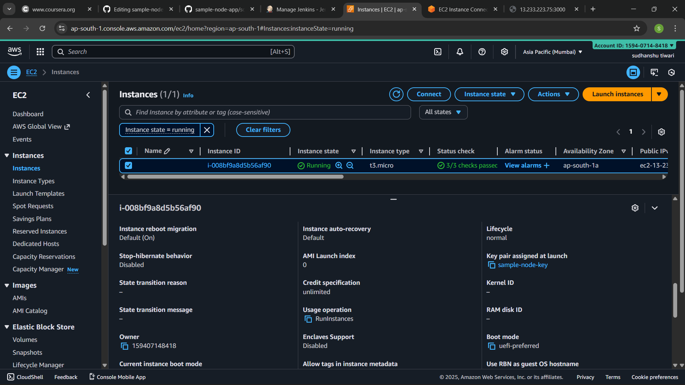
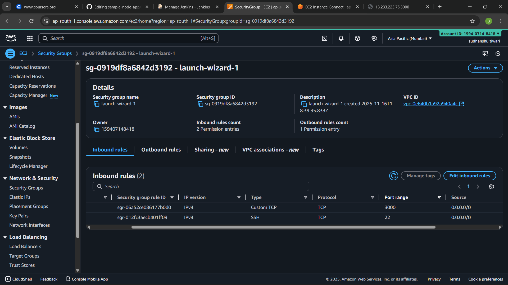
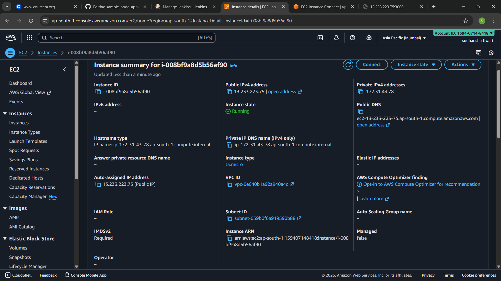
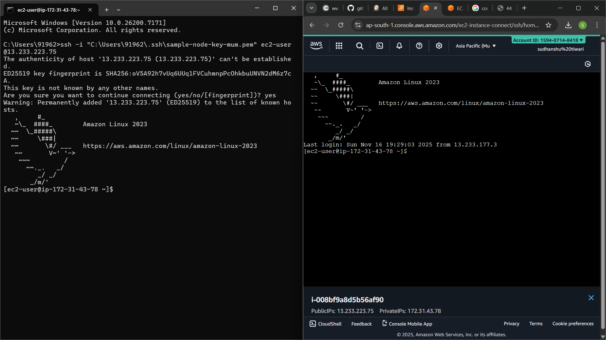
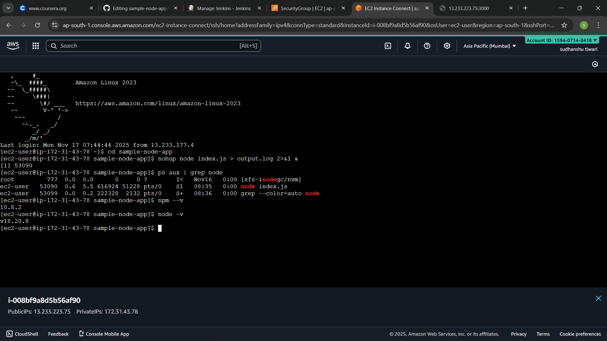
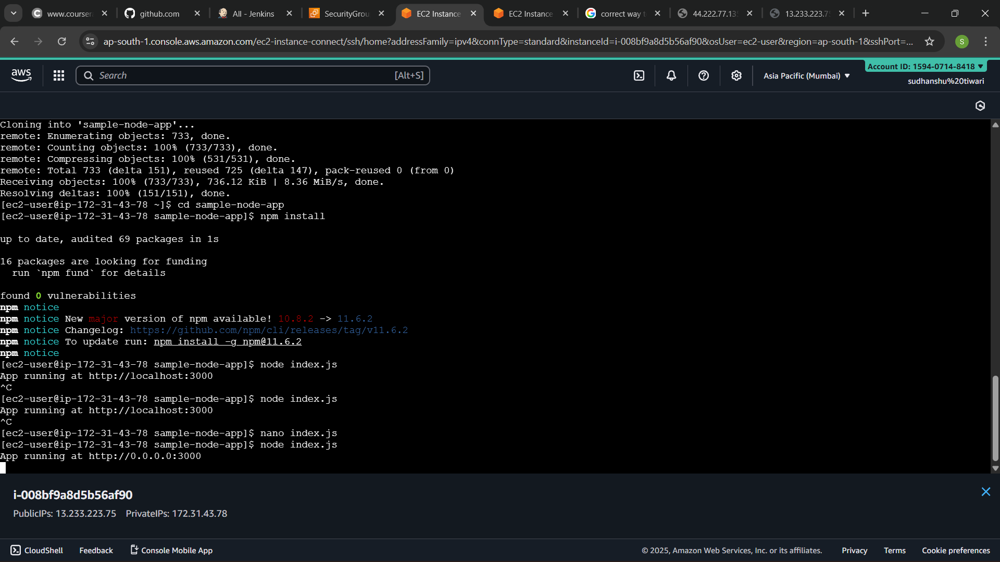
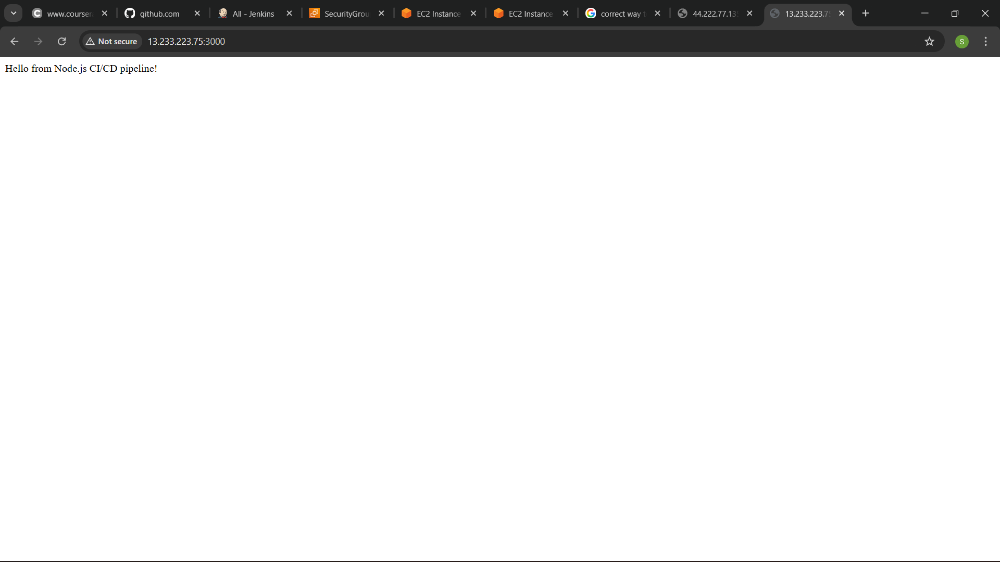

# AWS EC2 Node.js Deployment – DevOps Project  
_Deploying a Node.js web application on AWS EC2 with Linux process management_

## 🧱 Architecture Overview  

Local Machine (Git → Node.js App)
↓ (SSH)

AWS EC2 Instance

      ├─ Install Node.js & npm

      ├─ Clone/Deploy Application Code

      ├─ Configure Security Groups (SSH + App Port)

      ├─ Start the application in background (nohup/&)

      └─ Access via Public IP + Port

## 🛠 Technologies Used  

- AWS EC2 (Linux)  
- Linux shell & SSH  
- Node.js + npm  
- Git  
- Process Management: `nohup`, background processes (`&`)  
- Security Groups / Networking (Ports open)  

## 📌 Project Description  

 This project demonstrates how to deploy a Node.js web application on an AWS EC2 instance running Linux. It covers end-to-end deployment: server setup, dependencies, process management, and verifying             availability via public IP + port.  The goal is to showcase practical DevOps skills in cloud, Linux and runtime management.

## 🔧 Steps Performed  

1. **Launched AWS EC2 instance**  
   - Selected AMI (Amazon Linux / Ubuntu)  
   - Created Security Group: allowed SSH (22) & application port (e.g., 3000)  
   - Connected via SSH:

         ssh -i "your-key.pem" ec2-user@<public-ip>
     

2. **Installed required packages**  
   
         sudo yum update -y                 # (or apt update/upgrade for Ubuntu)  
         sudo yum install git -y            # or apt install git  
         sudo yum install nodejs npm -y     # or apt install nodejs npm
   
3. **Cloned application and installed dependencies**

         git clone https://github.com/sudhanshutiwarith9-commits/sample-node-app.git
   
         cd sample-node-app  
         npm install  

4. **Ran the application and tested**

       node index.js 

   Then open in browser:
   http://<public-ip>:3000

5. **Configured background process**

    To keep the app running even after logout:

       nohup node index.js > output.log 2>&1 &  

    Verify process:

         ps aux | grep node  

    Stop process:

        kill -9 <PID>

🐞 Troubleshooting Highlights

   - Resolved npm registry errors when installing dependencies

   - Fixed port unreachable issues by adjusting Security Group and network ACL

   - Handled permissions & directory issues (ownership, execution rights)

   - Ensured app persistence after logout using nohup and background processes

   - Verified correct Node.js version and dependency compatibility

🌐 Deployment URL  http://44.222..7.7135:3000       <!-- My ec2 public ip 44.222.77.135   -->
    

📁 Project Structure

    sample-node-app/
      │── index.js  
      │── package.json  
      │── package-lock.json  
      │── README.md (this file)

🎯 Outcome

   - Successfully deployed a Node.js application on AWS EC2

   - Gained hands-on experience with Linux, SSH, process management, security groups and cloud infrastructure

   - Demonstrated ability to troubleshoot, deploy and maintain a live application using DevOps practices

## 📸 Deployment Snapshots

Here are the important snapshots showing each step of the AWS EC2 Node.js deployment process:

1. *EC2 Launch Configuration*
   

2. *Security Group (Ports 22 & 3000)*
   

3. *Running EC2 Instance*
   

4. *Successful SSH Connection*
   

5. *Node.js & npm Installed*
   

6. *App Cloned from GitHub & Started*
   

7. *Node.js Application Running in Browser*
   

8. *App Running in Background with nohup 
   

👤 Author

   - Sudhanshu Tiwari

   - DevOps & Cloud Engineer

   - GitHub: https://github.com/sudhanshutiwarith9-commits

   - Email: sudhanshutiwarith9@gmail.com
